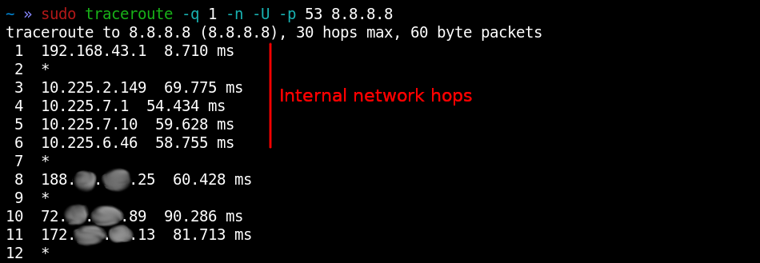
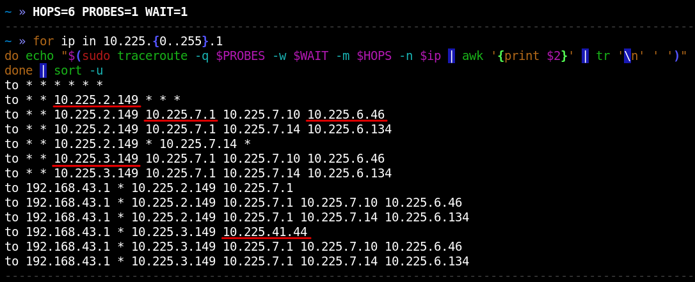
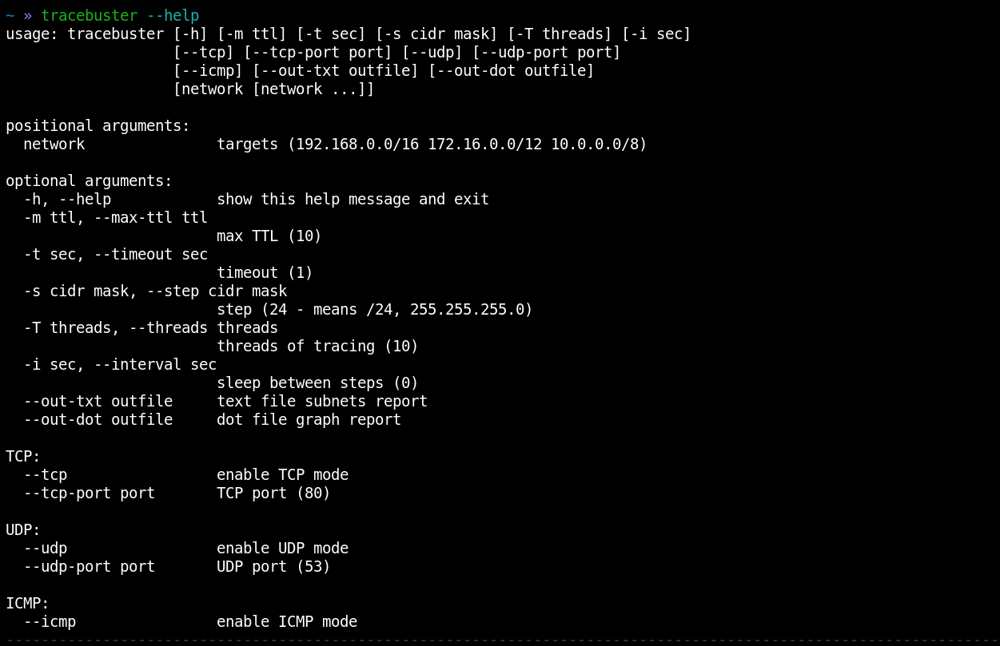
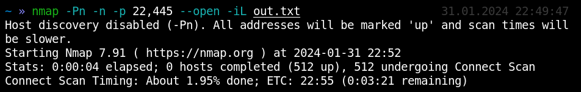
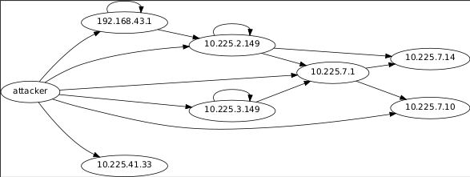

# Tracebuster

## Install

`pip3 install tracebuster`

## Idea

When connecting to unfamiliar networks, the attacker faces the problem of not knowing the location of live hosts in it.
However, often the trace can reveal information about internal addressing, thereby showing inhabited subnets:

Given this information disclosure, an attacker can perform a shallow trace of all private ranges in a reasonable amount of time:

This way we will see all possible routes and, more importantly, the internal networks themselves.
Since we make 1 request per subnet, the whole procedure does not take too much time.

In essence, this is an active analysis of ACLs of network equipment. In large companies with a lot of network equipment, it is difficult for administrators to keep in mind all the access lists and routes. And it is likely that there may be many "unwanted" routes present.

An example usage could be:
* penetration into the internal network. When the attacker does not have any information about the network;
* wi-fi networks (for example guest), where hosts of interest (for example domain hosts) can be located in deep network segments;
* mobile networks, home Internet.

## Implementation

The `tracebuster` utility performs this automation. It is designed to search for inhabited subnets at an arbitrary depth and has a flexible system of settings:

By default, if the tool is run without options, it will search all gray ranges (10/8, 172.16/12, 192.168/16), in increments of 255 hosts (/24 mask), in 10 threads, using ICMP for this.
Here is an example of how the utility works:

Work can be interrupted at any time using ctrl-c.

At the output, the tool creates a report in a text format convenient for parsing and use:

And also a visual graph:

